# Snap & Describe

A universal photo explorer with AI vision. Upload photos from any device (web, Android, iPad), get AI-powered descriptions, tags, and classifications from Claude Vision, and chat with AI about your photos.

Built as a portfolio project demonstrating Fastify + Expo Router + Anthropic Claude Vision + MinIO + PostgreSQL + Drizzle ORM across web and mobile platforms.

---

## Demo

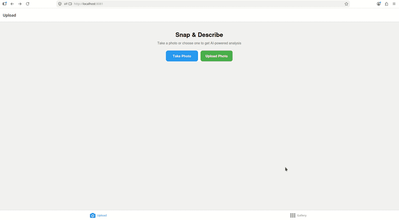
*End-to-end flow: take a photo → Claude Vision analysis → gallery → chat about the photo — on web, Android, and iPad.*

---

## Tech Stack

| Layer | Technology |
|-------|-----------|
| **Backend** | Node.js 24 (native TypeScript), Fastify 5, Drizzle ORM |
| **Database** | PostgreSQL 16, Drizzle migrations |
| **Object storage** | MinIO (S3-compatible) |
| **AI Vision** | Anthropic Claude Vision (claude-sonnet-4) |
| **Frontend** | Expo Router 6, React Native, TypeScript |
| **Camera** | expo-camera (CameraView — live preview on all platforms) |
| **Image picker** | expo-image-picker (gallery/file selection) |
| **Infrastructure** | Docker Compose (4 services) |
| **Testing** | Vitest (API + Expo) |

---

## How to Run

**Prerequisites:** Node.js 24+, Docker, and Docker Compose. Get an `ANTHROPIC_API_KEY` from https://console.anthropic.com.

```bash
# 1. Clone the repository
git clone https://github.com/peelmicro/snap-and-describe.git
cd snap-and-describe

# 2. Copy environment template and add your Anthropic API key
cp .env.example .env
# Edit .env and set ANTHROPIC_API_KEY=sk-ant-...

# 3. Install dependencies for API and Expo projects
npm run install:all

# 4. Start PostgreSQL + MinIO + API in Docker
npm run dc:dev

# 5. Run Drizzle migrations and seed reference data
npm run db:setup

# 6. Start the Expo dev server (web + mobile)
npm run expo:start
```

The last command shows a QR code and URLs. Scan it with **Expo Go** (Android) or the **Camera app** (iOS/iPad), or press **`w`** to open the web version at http://localhost:8081.

This starts:
- **PostgreSQL** on port **5432**
- **MinIO** on port **9000** (Console: http://localhost:9001, login: minioadmin / minioadmin)
- **API** on port **3000** (http://localhost:3000/health)
- **Expo dev server** on port **8081** (http://localhost:8081 for web)

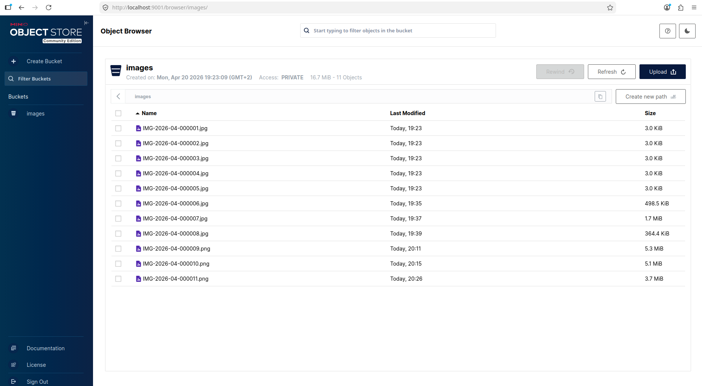
*MinIO Object Browser — seeded images plus user uploads stored in the `images` bucket with auto-generated codes.*

### Production-like web deployment (optional)

To serve the Expo web build via Nginx instead of the dev server:

```bash
docker compose up -d --build      # Build and start all 4 services including Nginx web (port 8080)
npm run db:setup                  # Only needed on first run
```

Open http://localhost:8080 — this is the static export served by Nginx (no hot reload, no mobile testing).

> **Note:** For mobile testing via Expo Go, always use `npm run expo:start` — the Nginx container only serves the web build.

### Environment Variables

| Variable | Required | Default | Description |
|----------|----------|---------|-------------|
| `ANTHROPIC_API_KEY` | Yes | — | Claude Vision API key (get from https://console.anthropic.com) |
| `POSTGRES_DB` | No | `snapdescribe` | Database name |
| `POSTGRES_USER` | No | `snap` | Database user |
| `POSTGRES_PASSWORD` | No | `snap123` | Database password |
| `MINIO_ROOT_USER` | No | `minioadmin` | MinIO access key |
| `MINIO_ROOT_PASSWORD` | No | `minioadmin` | MinIO secret key |
| `API_PORT` | No | `3000` | API server port |

---

## Convenience Scripts

| Command | What it does |
|---------|-------------|
| `npm run install:all` | Install dependencies for API and Expo projects |
| `npm run dc:dev` | Start PostgreSQL + MinIO + API in Docker (for development) |
| `npm run dc:up` | Start all 4 services (including Nginx web) |
| `npm run dc:down` | Stop all containers |
| `npm run dc:ps` | Show running containers |
| `npm run dc:clean` | Stop containers and **remove volumes** (fresh start) |
| `npm run dc:logs` | Follow all container logs |
| `npm run db:generate` | Generate Drizzle migration from schema changes |
| `npm run db:migrate` | Apply pending migrations to PostgreSQL |
| `npm run db:seed` | Seed reference data (types, images, classifications) |
| `npm run db:setup` | Run migrations + seed (one command) |
| `npm run api` | Start API locally (without Docker) |
| `npm run api:test` | Run API tests (Vitest) |
| `npm run api:lint` | TypeScript type-check API (`tsc --noEmit`) |
| `npm run expo:start` | Start Expo dev server (web + mobile) |
| `npm run expo:web` | Start Expo web only |
| `npm run expo:test` | Run Expo tests (Vitest) |
| `npm run expo:lint` | Lint Expo project (ESLint) |

---

## Features

### Photo Upload & AI Analysis

Upload a photo via camera or file picker. The API:
1. Stores the image in MinIO (S3-compatible object storage)
2. Sends it to Claude Vision for analysis
3. Returns: AI-generated description, suggested name, up to 5 tags, and classifications with properties

### Live Camera (All Platforms)

Uses `expo-camera`'s `CameraView` component which provides:
- **Web:** Live webcam preview via `getUserMedia` API
- **Android/iOS:** Native camera feed
- Front/back camera toggle

> **Why `expo-camera` instead of `expo-image-picker` for camera?** `expo-image-picker`'s `launchCameraAsync()` on desktop web falls back to a file picker dialog (it uses the HTML `<input capture>` attribute which desktop browsers ignore). `expo-camera`'s `CameraView` uses `getUserMedia` directly, providing a real live camera feed from the computer's webcam on desktop web, and native camera on mobile.

### Gallery with Search

3-column photo grid (Google Photos style) with full-text search across descriptions, names, and tags. Uses PostgreSQL `to_tsvector`/`plainto_tsquery` with ILIKE fallback.

### Chat with AI

Ask follow-up questions about any photo. Claude receives the photo's description, tags, and classifications as context, plus the full conversation history for context-aware responses.

---

## Screenshots

The app was tested on three platforms: **desktop web (Chrome)**, **Android (Expo Go)**, and **iPad (Expo Go)**. The same Expo Router codebase powers all three.

### Upload / Home screen

| Web | Android | iPad |
|-----|---------|------|
| 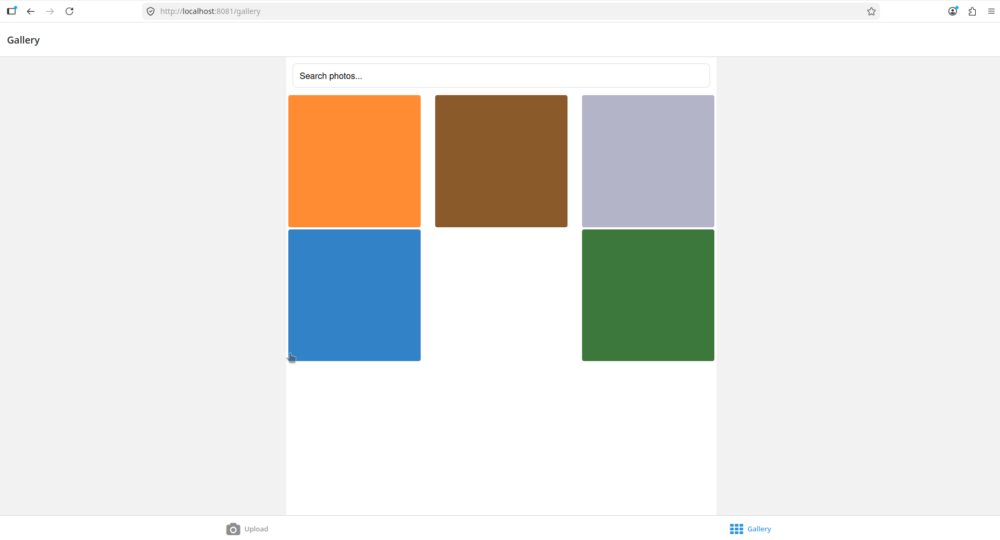 | 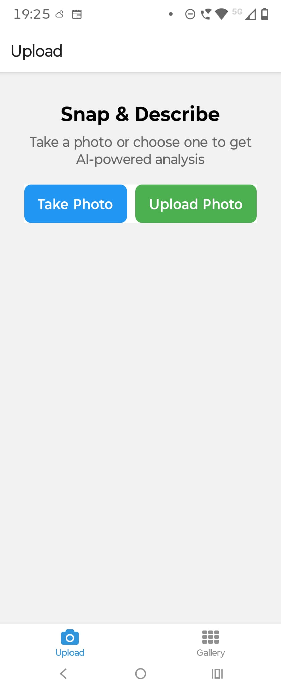 | 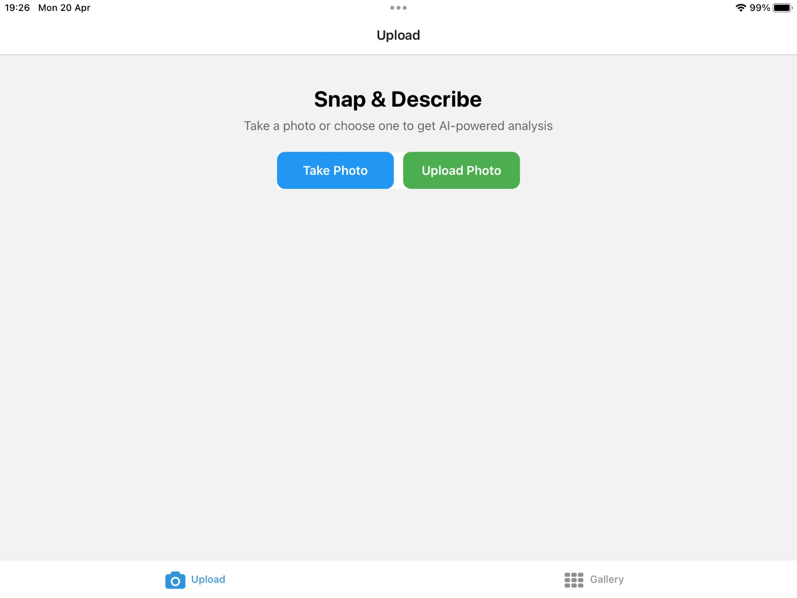 |

*Initial app state across platforms — the Upload tab with **Take Photo** (live camera) and **Upload Photo** (file/gallery picker).*

### Upload flow (web, file picker)

| Uploading | Analysis complete |
|-----------|------------------|
| 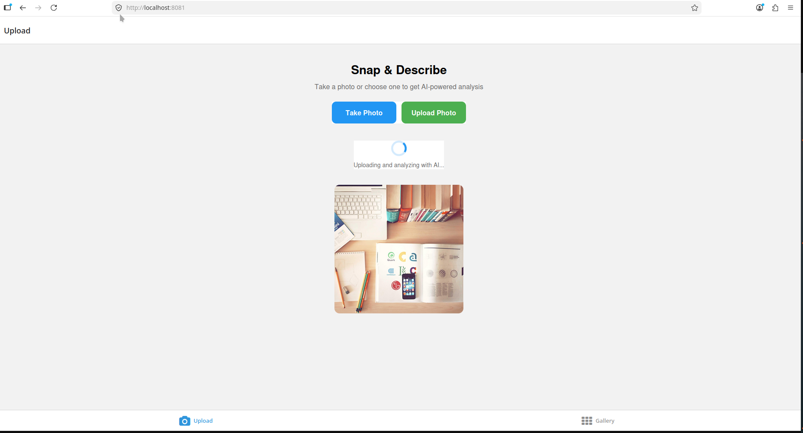 | 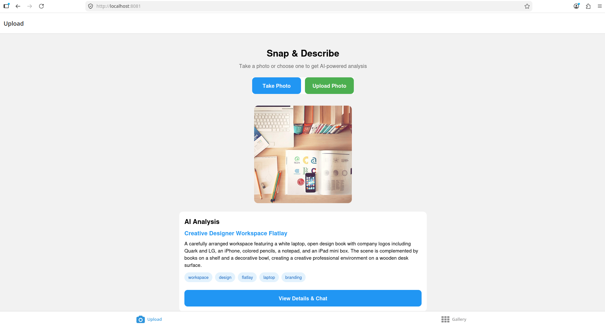 |

*Pick a file, watch the "Uploading and analyzing with AI…" indicator, then see the AI-generated name, description, and tags inline.*

### Take Photo flow (mobile, live camera)

| Android — analyzing | Android — result |
|--------------------|------------------|
| 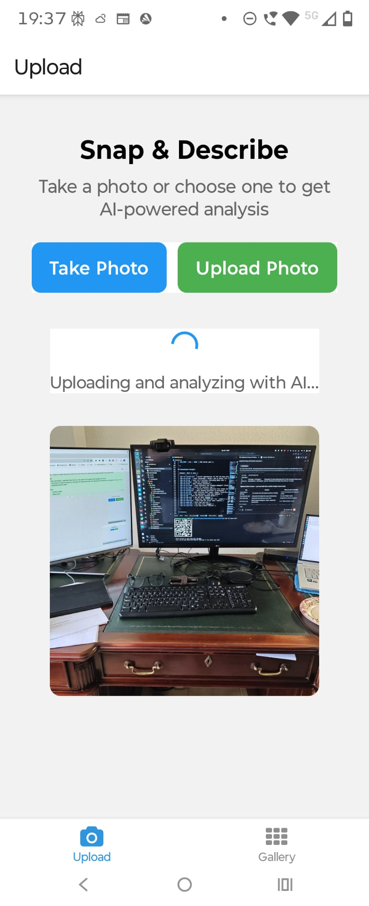 | 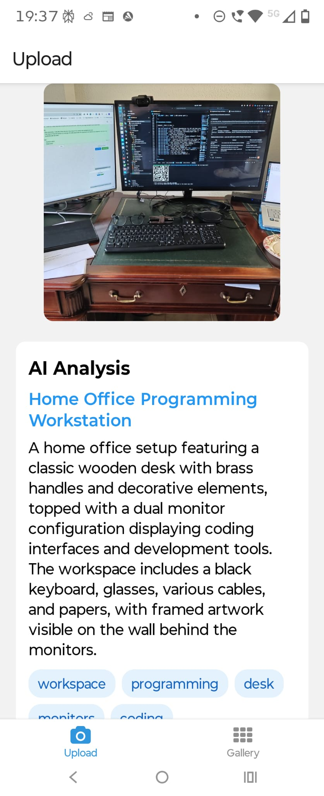 |

| iPad — analyzing | iPad — result |
|------------------|---------------|
| 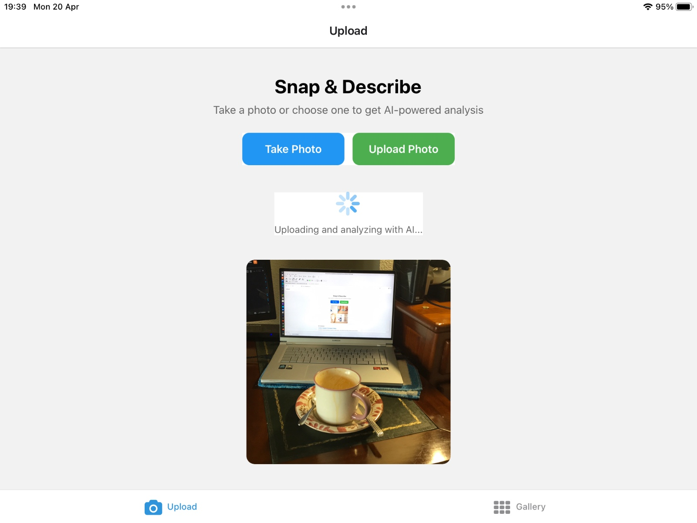 | 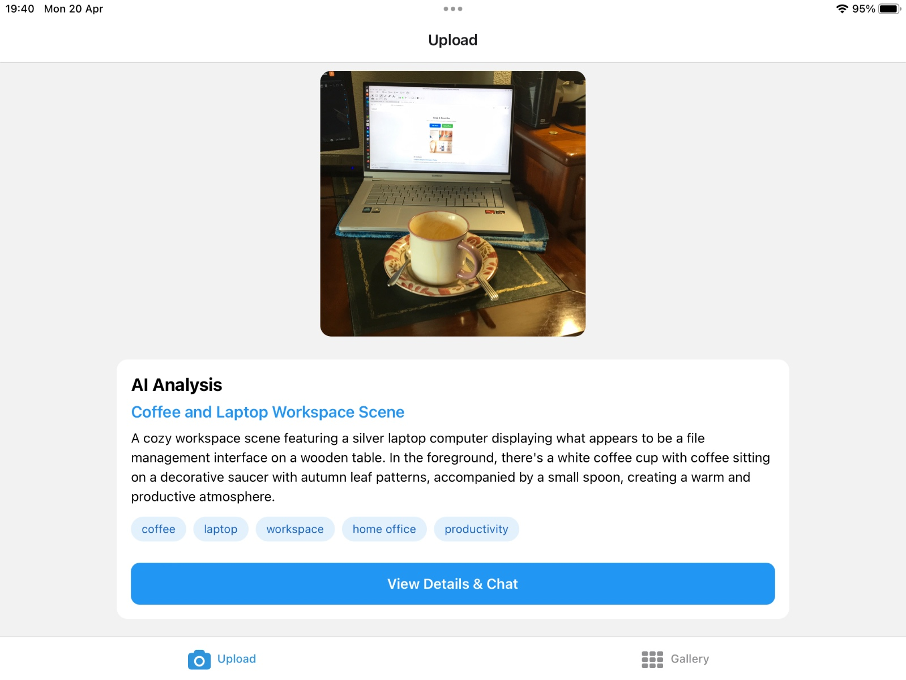 |

*Native camera capture via `expo-camera`'s `CameraView`, then automatic upload → Claude Vision analysis → "View Details & Chat".*

### Gallery (3-column grid + search)

| Web | Android | iPad |
|-----|---------|------|
| 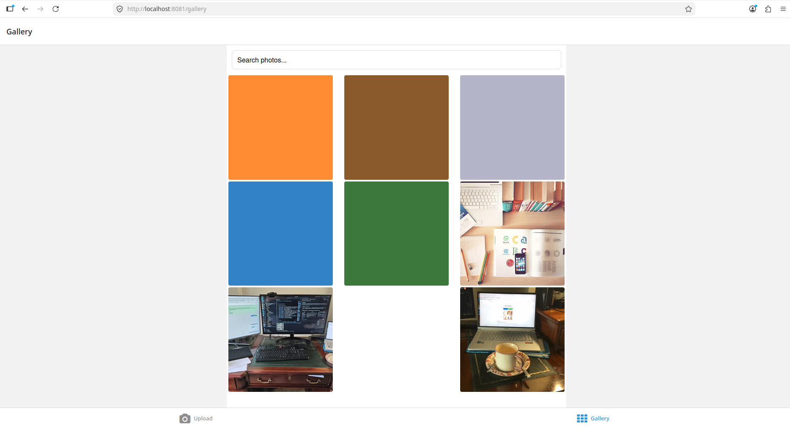 | 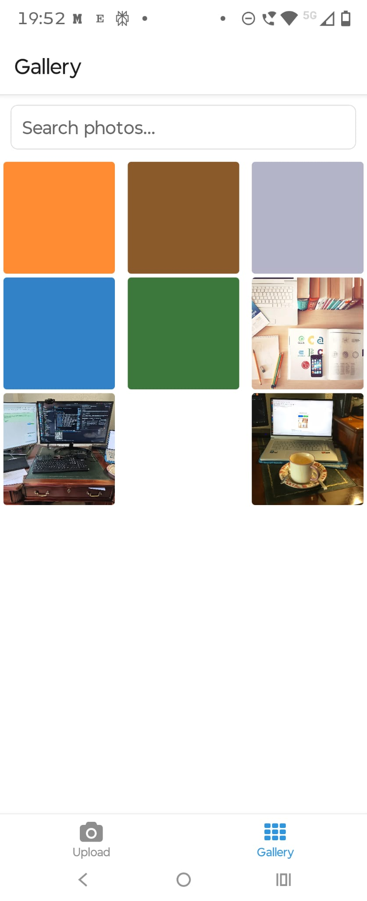 | 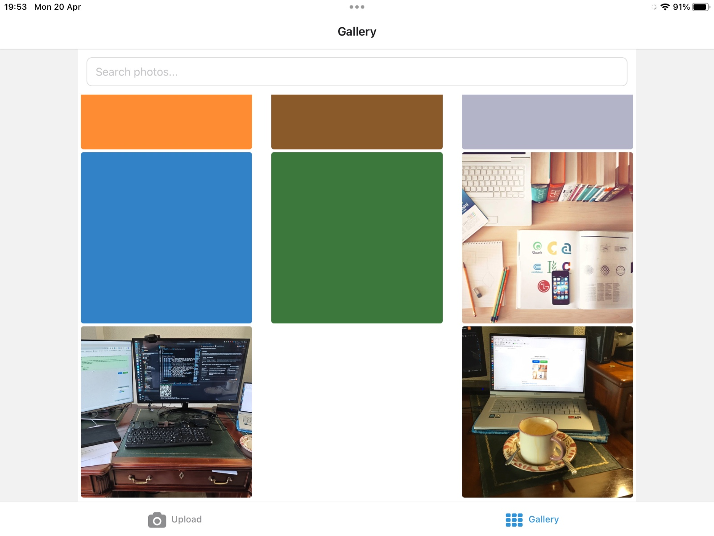 |

*Seeded solid-color thumbnails alongside real uploaded photos, with full-text search across descriptions, names, and tags.*

### Photo detail + chat

| Detail view | Ask about the photo |
|-------------|--------------------|
| 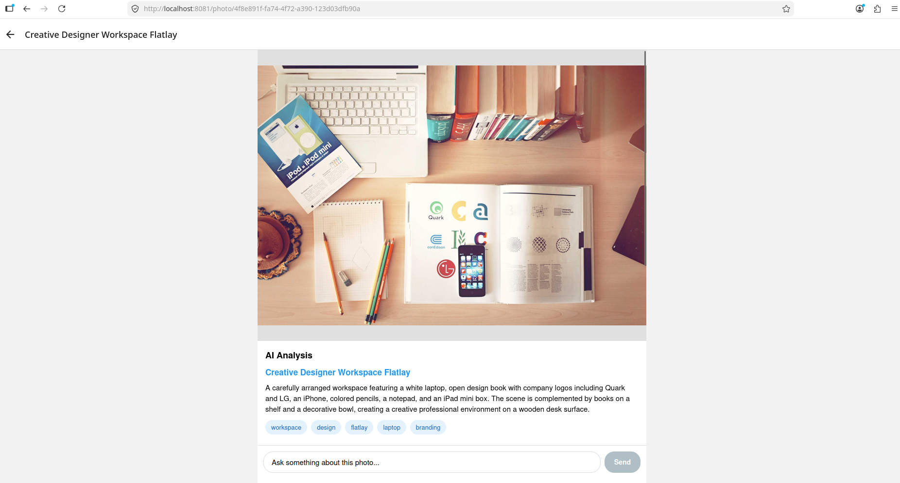 | 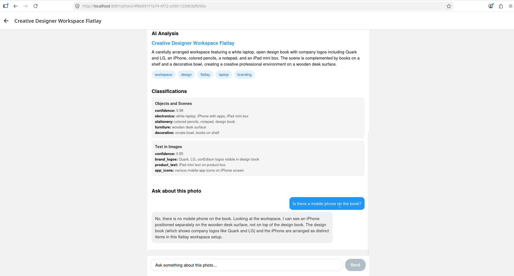 |

*AI analysis (suggested name, description, tags), classifications with properties, and a chat that receives the photo context plus full conversation history.*

---

## API Endpoints

| Method | Path | Description |
|--------|------|-------------|
| GET | `/health` | Health check |
| GET | `/types` | List all classification types |
| GET | `/types/:id` | Get type by ID |
| GET | `/types/code/:code` | Get type by code |
| POST | `/types` | Create type |
| PUT | `/types/:id` | Update type |
| DELETE | `/types/:id` | Delete type |
| GET | `/images` | List images (paginated, `?type=food`, `?tag=sunset`) |
| GET | `/images/:id` | Get image with classifications, conversations, presigned URL |
| GET | `/images/:id/file` | Serve image file (proxy from MinIO) |
| GET | `/images/code/:code` | Get image by human-readable code |
| POST | `/images/upload` | Upload image → MinIO + Claude Vision analysis |
| PUT | `/images/:id` | Update image metadata |
| DELETE | `/images/:id` | Delete image (cascades to classifications, conversations, MinIO) |
| GET | `/classifications` | List all classifications with type and image info |
| GET | `/classifications/:id` | Get classification by ID |
| GET | `/classifications/code/:code` | Get classification by code |
| GET | `/classifications/image/:imageId` | Get classifications for an image |
| DELETE | `/classifications/:id` | Delete classification |
| POST | `/images/:imageId/chat` | Send message about image (creates conversation if first) |
| GET | `/images/:imageId/conversations` | Get all conversations for an image |
| GET | `/conversations/:id` | Get conversation with messages |
| GET | `/search?q=sunset` | Full-text search across descriptions and tags |

`.http` files for VS Code REST Client are in `apps/api/http/`.

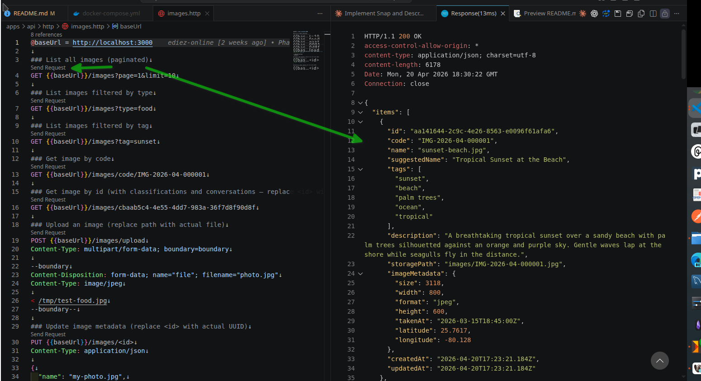
*Hitting `GET /images/:id` from VS Code's REST Client — the response includes the AI description, tags, classifications, and presigned MinIO URL.*

---

## Testing

```bash
npm run api:test     # 39 API tests
npm run expo:test    # 13 Expo tests
```

### Test breakdown

| File | Tests | What it covers |
|------|-------|---------------|
| `tests/vision-service.test.ts` | 14 | Response parsing, tag limiting, classification filtering, error handling, media types |
| `tests/code-generator.test.ts` | 5 | Code format, prefix, year/month, sequence padding |
| `tests/search.test.ts` | 14 | Query validation, pagination, LIKE patterns, response normalization |
| `tests/chat-service.test.ts` | 6 | Prompt construction, message history, fallbacks |
| `__tests__/api-config.test.ts` | 3 | API URL by platform (web/Android/iOS) |
| `__tests__/captured-photo.test.ts` | 5 | Camera → home screen photo transfer |
| `__tests__/types.test.ts` | 5 | TypeScript interface validation |

**Total: 52 tests** — all passing.

### Testing approach

- **API:** Vitest with node environment. Vision service and chat logic tested via response parsing and validation — Claude API is not called in tests. Code generator and search logic tested as pure functions.
- **Expo:** Vitest with node environment. Platform-specific logic (API URL), shared state modules, and TypeScript interfaces tested as pure logic — no React component rendering.

---

## Project Structure

```
snap-and-describe/
├── apps/
│   ├── api/                          # Fastify backend (TypeScript native)
│   │   ├── src/
│   │   │   ├── types/                # Types entity (classification categories)
│   │   │   ├── images/               # Images entity, upload, file proxy
│   │   │   ├── classifications/      # ImageClassifications entity
│   │   │   ├── conversations/        # Conversations + Messages, chat service
│   │   │   ├── vision/               # Claude Vision integration
│   │   │   ├── search/               # Full-text search
│   │   │   ├── storage/              # MinIO client wrapper
│   │   │   ├── seed/                 # Seed data (types, images, classifications)
│   │   │   ├── common/               # Code generator utility
│   │   │   ├── db/                   # Drizzle schema + connection
│   │   │   └── server.ts             # Fastify app entry point
│   │   ├── tests/                    # Vitest tests (4 files, 39 tests)
│   │   ├── http/                     # VS Code REST Client .http files
│   │   ├── drizzle/                  # Generated SQL migration files
│   │   ├── Dockerfile
│   │   └── drizzle.config.ts
│   └── mobile/                       # Expo universal app (iOS + Android + Web)
│       ├── app/
│       │   ├── _layout.tsx           # Root layout (Stack navigator, theme)
│       │   ├── camera.tsx            # Live camera screen (CameraView)
│       │   ├── photo/[id].tsx        # Photo detail + chat (dynamic route)
│       │   └── (tabs)/
│       │       ├── _layout.tsx       # Tab bar (Upload + Gallery)
│       │       ├── index.tsx         # Upload screen (camera + file picker)
│       │       └── gallery.tsx       # Photo grid + search
│       ├── hooks/                    # useApi (images, search, upload, chat), useCapturedPhoto
│       ├── types/                    # TypeScript interfaces
│       ├── constants/                # API URL config
│       ├── __tests__/                # Vitest tests (3 files, 13 tests)
│       ├── Dockerfile                # Multi-stage: Expo export → Nginx
│       └── nginx.conf                # SPA routing config
├── docker-compose.yml                # PostgreSQL + MinIO + API + Web (Nginx)
├── .env.example                      # Environment variable template
├── package.json                      # Root convenience scripts
├── CLAUDE.md                         # Project conventions for Claude Code
└── README.md
```

---

## Assumptions

1. **Claude Vision for all analysis** — no fallback to other providers. If the API key is missing, images are stored but not analyzed.
2. **MinIO for local development** — S3-compatible API means switching to production S3/GCS requires only changing the endpoint URL.
3. **No authentication** — in production, JWT or session-based auth with role-based access control.
4. **Seed images are solid colors** — generated with `sharp` to avoid committing binary files. Real photos uploaded via the app get full AI analysis.
5. **Single conversation per image** — the chat loads the most recent conversation. Multiple conversations are supported by the schema but the UI shows only the latest.
6. **`--experimental-transform-types`** — Node.js 24's native TypeScript support is experimental. The flag resolves `.ts` imports at runtime without a build step.
7. **Local IP for mobile testing** — physical devices need the machine's local IP in `constants/api.ts`. This value changes per network.
8. **Human-readable codes** — format `PREFIX-YYYY-MM-SEQUENCE` (e.g., `IMG-2026-04-000001`) for user-friendly identifiers alongside UUIDs.

---

## Decisions Postponed

| Decision | Why deferred |
|----------|-------------|
| Real image thumbnails | Seed images use solid colors from `sharp`. A production system would generate actual thumbnails on upload |
| Image cropping/editing | `expo-image-picker` supports `allowsEditing` but we only use it on gallery picks, not camera captures |
| Offline support | Would need local SQLite + sync queue. Out of scope for this demo |
| Multi-language chat | Claude can respond in any language, but the UI is English only |
| Image EXIF extraction | The schema supports GPS, dimensions, and timestamp metadata but we don't extract it from uploaded files yet |
| Rate limiting | No API rate limiting. In production, add `@fastify/rate-limit` |

---

## What I Would Do Differently

1. **Proper image thumbnails** — generate multiple sizes on upload (thumbnail, medium, full) using `sharp` for faster gallery loading.
2. **WebSocket for chat** — replace polling with real-time chat via WebSocket or Server-Sent Events for streaming AI responses.
3. **Offline-first architecture** — use Expo SQLite for local caching, sync with the API when online. Essential for a mobile photo app.
4. **Image EXIF parsing** — extract GPS coordinates, camera model, and timestamp from uploaded photos using `exif-parser` or `sharp.metadata()`.
5. **State management** — add `@tanstack/react-query` or Zustand for proper client-side caching and background refetching.
6. **CI/CD pipeline** — GitHub Actions for automated testing, Docker image builds, and deployment on merge to main.
7. **Structured logging** — replace Fastify's default logger with `pino-pretty` for development and JSON output for production log aggregation.

---

## How to Deploy for Production

### API (Fastify)

| Concern | Approach |
|---------|---------|
| **Container** | Deploy the `apps/api` Docker image to any container platform — Kubernetes, AWS ECS, Google Cloud Run, or Azure Container Apps |
| **Database** | Replace Docker PostgreSQL with a managed service (RDS, Cloud SQL, Azure Database for PostgreSQL) with automated backups |
| **Object storage** | Replace MinIO with AWS S3, Google Cloud Storage, or Azure Blob Storage — just change the endpoint URL (S3-compatible API) |
| **Migrations** | Run `npm run db:migrate` as an init container or startup script before the API starts |
| **Secrets** | Store `DATABASE_URL`, `ANTHROPIC_API_KEY`, and MinIO credentials in a secrets manager (AWS Secrets Manager, GCP Secret Manager, Azure Key Vault) |
| **Observability** | Add structured logging, metrics (Prometheus/OpenTelemetry), and distributed tracing |
| **CI/CD** | Build and push Docker images on merge to main; deploy with a rolling update strategy |

### Web (Expo Web Export)

| Concern | Approach |
|---------|---------|
| **Static hosting** | `npx expo export --platform web` generates a static site. Deploy to Vercel, Netlify, AWS CloudFront + S3, or Firebase Hosting |
| **CDN** | Serve static assets through a CDN for global edge caching (CloudFront, Cloud CDN, or Akamai) |
| **Environment** | Inject API URL at build time or use a runtime config endpoint |
| **HTTPS** | Required for camera access (`getUserMedia` only works on HTTPS in production) |

### Android

| Concern | Approach |
|---------|---------|
| **Build** | `eas build --platform android` (Expo Application Services) — generates an AAB or APK in the cloud |
| **Distribution** | Upload the AAB to Google Play Console for Play Store distribution |
| **OTA updates** | `eas update` pushes JavaScript-only updates without going through the Play Store review process |
| **Signing** | EAS manages keystores and signing certificates automatically |
| **Internal testing** | Use Google Play's internal testing track for team testing before public release |

### iOS / iPad

| Concern | Approach |
|---------|---------|
| **Build** | `eas build --platform ios` — generates an IPA in the cloud (no Mac needed for building) |
| **Distribution** | Upload the IPA to App Store Connect for App Store / TestFlight distribution |
| **OTA updates** | `eas update` pushes JavaScript-only updates without App Store review |
| **Signing** | EAS manages provisioning profiles and certificates. Requires an Apple Developer account ($99/year) |
| **TestFlight** | Use TestFlight for beta testing with up to 10,000 testers before public release |

### All Platforms (via EAS)

```bash
# Install EAS CLI
npm install -g eas-cli

# Configure the project
cd apps/mobile
eas init

# Build for all platforms
eas build --platform android    # Generates APK/AAB
eas build --platform ios        # Generates IPA
npx expo export --platform web  # Generates static site

# Push over-the-air updates (JS only, no rebuild needed)
eas update --branch production --message "Bug fix"
```

---

## Trade-offs

| Decision | Trade-off |
|----------|----------|
| **Fastify over NestJS** | Lighter, faster, closer to bare Node.js — demonstrates understanding of fundamentals. Trade-off: less structure out of the box |
| **Drizzle over TypeORM/Prisma** | SQL-like syntax, zero overhead, fully TypeScript. Trade-off: newer ecosystem, fewer resources online |
| **Node.js 24 native TS** | No build step, faster development loop. Trade-off: experimental flag, some libraries may not support it |
| **MinIO over local filesystem** | S3-compatible API, easy to switch to production S3/GCS. Trade-off: extra Docker service |
| **Claude Vision over Google Vision** | Better natural language descriptions and follow-up conversations. Trade-off: cost per API call |
| **PostgreSQL full-text search** | Simpler setup, no extra service. Trade-off: less powerful than Elasticsearch for complex queries at scale |
| **Expo Router** | Single codebase for web + mobile. Trade-off: some web-specific optimizations are harder |
| **expo-camera over expo-image-picker for camera** | Real live preview on desktop web. Trade-off: more code than `launchCameraAsync()` |
| **Image proxy endpoint** | Works on all platforms (physical devices can't reach MinIO's localhost). Trade-off: all image traffic goes through the API |
| **Raw SQL for search** | Avoids Drizzle ORM limitations with CTEs and column references. Trade-off: less type safety, manual camelCase normalization |

---

## AI Tools Used

This project was developed with **Claude Code** (Anthropic's CLI tool). Per the assessment instructions, all AI assistance is documented here:

- **Architecture decisions** — discussed stack choices (Fastify vs NestJS, Drizzle vs Prisma, expo-camera vs expo-image-picker), database schema design, and Docker strategies with Claude Code.
- **Code generation** — Fastify routes, Drizzle schema, vision/chat services, Expo screens, React Native components, Docker configurations, and test suites were written with Claude Code assistance.
- **Debugging** — resolved issues including Node.js `--experimental-strip-types` vs `--experimental-transform-types` (import resolution), `FastifyInstance` type-only import errors, camera PNG/JPEG mime type mismatch with Claude Vision, web FormData upload differences, presigned URL localhost issues on physical devices, base64 data URI too large for URL parameters.
- **Cross-platform testing** — tested on desktop web (Chrome), Android (Expo Go), and iPad (Expo Go) with Claude Code guidance on platform-specific fixes.
- **Documentation** — this README and the implementation plan were written with Claude Code.
- **CLAUDE.md** — the repository includes a `CLAUDE.md` file at the root, which provides project conventions, structure, and coding guidelines that Claude Code uses as context.

All generated code was reviewed, understood, and validated before being committed.
